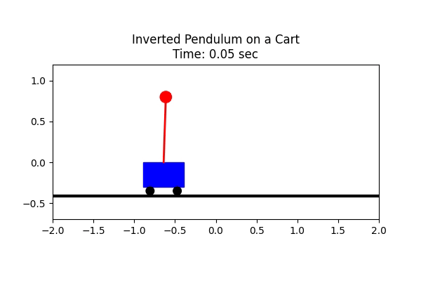

# Inverted Pendulum on a Cart Control using Soft Actor-Critic (SAC)
This repository includes the Python code for creating a custom environment for an inverted pendulum on a cart. It covers defining the step function, implementing a quadratic reward for regulation, resetting the environment, and performing numerical integration using the Runge-Kutta method.

Additionally, the Soft Actor-Critic (SAC) algorithm [https://arxiv.org/abs/1812.05905](https://proceedings.mlr.press/v80/haarnoja18b/haarnoja18b.pdf) is implemented and tuned for this environment. Various learning curves are plotted to ensure the algorithm's convergence and demonstrate the effectiveness of the learned optimal policy.

These codes were developed as part of the Intelligent Control and Fault Diagnosis course (Spring 2025) at Amirkabir University of Technology (Tehran Polytechnic).

## Animation of the Learned Agent

